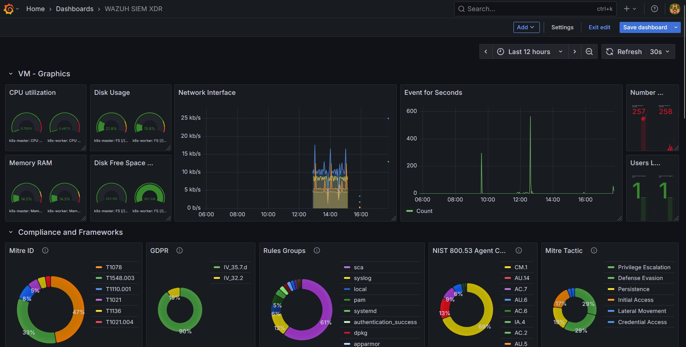

# 🛡️ Laboratório de Observabilidade SecOps: SOC Unificado

Este projeto demonstra a arquitetura e implementação de um ecossistema de monitoramento híbrido, correlacionando métricas de performance (Zabbix) e alertas de segurança (Wazuh) de um cluster Kubernetes (K8s) em um único dashboard no Grafana.

## 🎯 Objetivo
Quebrar os silos tradicionais de dados entre as equipes de Infraestrutura e Segurança (Blue Team), criando um "Single Pane of Glass" para identificar rapidamente se uma anomalia de processamento é falha de infraestrutura ou um ataque em andamento.

## 💻 Stack Tecnológica
* **Alvo:** Kubernetes (kubeadm, containerd, Flannel)
* **SIEM/XDR:** Wazuh v4.14 (All-in-One)
* **Monitoramento:** Zabbix v7.0 LTS
* **Visualização:** Grafana v10.4.5
* **SO Base:** Ubuntu 24.04 (5 VMs)

## 🏗️ Arquitetura e Integração
1. **Agentes:** `wazuh-agent` e `zabbix-agent` implantados nos nós K8s (Master e Workers).
2. **Conexões do Grafana:**
   * Zabbix conectado via API JSON-RPC.
   * Wazuh conectado diretamente ao banco de dados OpenSearch na porta `9200`.

## 🔧 Solução de Problemas (Troubleshooting)
O maior desafio da integração foi o bloqueio de conexão entre o Grafana e o banco de dados do Wazuh (*Connection Refused*). 
**Resolução:** Análise de portas locais (`ss -ltnp`) e reconfiguração do arquivo `opensearch.yml` no nó do Wazuh-Indexer, alterando o `network.host` de `127.0.0.1` para `0.0.0.0`, liberando o binding de rede externo.

Abaixo, o dashboard unificado em operação. Note a correlação em tempo real entre a saúde do cluster (CPU/Rede) e o mapeamento de táticas do MITRE ATT&CK e conformidade (NIST/GDPR):

Com este setup, o tempo médio para diagnosticar a causa raiz de incidentes (MTTR) foi reduzido a segundos, provando o valor tático do DevSecOps e da observabilidade unificada.
