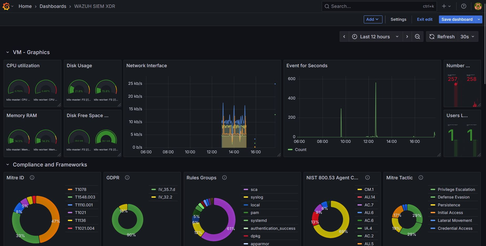

 

 

## 🎯 Objetivo

Quebrar os silos tradicionais de dados entre as equipes de Infraestrutura e Segurança (Blue Team), criando um **"Single Pane of Glass"** para identificar rapidamente se uma anomalia de processamento é uma simples falha de infraestrutura ou um ataque em andamento.

---

## 💻 Stack Tecnológica

  
    
  
  
  

 

* **Alvo:** Kubernetes (kubeadm, containerd, Flannel)
* **SIEM/XDR:** Wazuh v4.14 (All-in-One)
* **Monitoramento:** Zabbix v7.0 LTS
* **Visualização:** Grafana v10.4.5
* **SO Base:** Ubuntu 24.04 (5 VMs)

---

## 🏗️ Arquitetura e Integração

1. **Agentes:** `wazuh-agent` e `zabbix-agent` implantados nos nós K8s (Master e Workers).
2. **Conexões do Grafana:**
   * **Zabbix:** Conectado via API JSON-RPC.
   * **Wazuh:** Conectado diretamente ao banco de dados OpenSearch na porta `9200`.

---

## 🔧 Solução de Problemas (Troubleshooting)

> **O Desafio:** Bloqueio de conexão entre o Grafana e o banco de dados do Wazuh (*Connection Refused*).  
> **A Resolução:** Análise de portas locais (`ss -ltnp`) e reconfiguração do arquivo `opensearch.yml` no nó do Wazuh-Indexer. Alteração crítica do `network.host` de `127.0.0.1` para `0.0.0.0`, liberando o binding de rede para acesso externo seguro.

---

## 👁️ Painel em Operação (Single Pane of Glass)

Abaixo, o dashboard unificado em operação. Note a correlação em tempo real entre a saúde do cluster (CPU/Rede) e o mapeamento de táticas do **MITRE ATT&CK** e conformidade (NIST/GDPR).

  

 

> **Resultado:** Com este setup, o tempo médio para diagnosticar a causa raiz de incidentes (MTTR) foi reduzido a segundos, provando o valor tático do DevSecOps e da observabilidade unificada.

 

  

